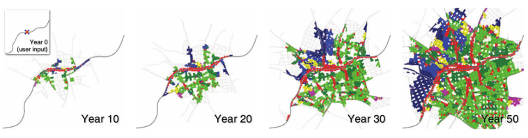

Modellierte Städte werden in vielen Anwendungen benötigt: Für Unterhaltung wie Filme und Spiele, für militärisches Training und für Landnutzungsplanung. Aber manuelles Modellieren ist aufwändig und Künstler bzw. Designer sind teuer. Deshalb gibt es mehrere Ansätze Stadtstrukturen und Gebäude prozedural zu erstellen, die hier vorgestellt werden.

1. Einführung und Grundlagen
2. Prozedurale Stadtgenerierung
    1. Inputparameter
    2. Straßennetzmodellierung
        1. Primäres und sekundäres Straßennetz
        2. Straßenmuster
        3. Straßenwachstum
            - greedy, parallel
            - Konfliktlösung (Kreuzungen, Hindernisse)
        4. Implementierung: L-Systeme / Priority Queue
        5. Alternative Methoden: Tensorfelder / Zeitsimulation
    3. Gebäudemodellierung
        1. Lot subdivision
        2. Architektur: L-systems, split grammars, etc.
3. Anwendungen
4. Beispielprojekte

Bildquelle: @weber_interactive_2009

<!--
alte vorträge:

http://cg.ivd.kit.edu/1254.php
http://cg.ivd.kit.edu/918.php
http://cg.ivd.kit.edu/773.php
http://cg.ivd.kit.edu/675.php
http://cg.ivd.kit.edu/556.php
http://cg.ivd.kit.edu/450.php
http://cg.ivd.kit.edu/179.php
-->
## Literatur
